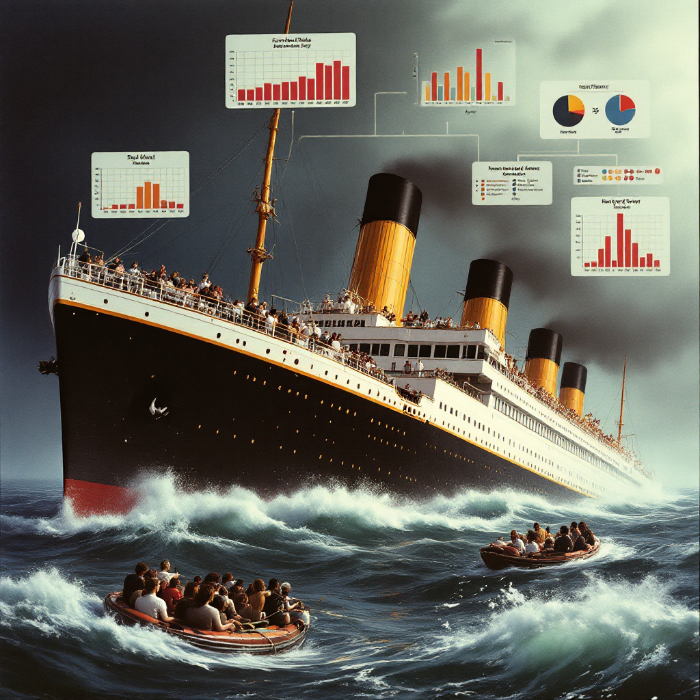

---

# **Project : Titanic Survival Prediction**

---

#### **Introduction:**
This project aims to utilize machine learning techniques to build a model that can predict whether a passenger survived the tragic sinking of the Titanic. This is a famous competition in the field of machine learning, where the goal is to explore the relationships between various demographic and social factors that may have affected survival probability.

---

#### **Project Objective:**
The objective of this project is to:
- Build a predictive model using a dataset that includes passenger information such as gender, age, ticket class, embarkation port, and more.
- Identify key factors that significantly impact survival chances.
- Provide a machine learning solution to predict the survival outcomes of passengers in an unseen test dataset.

---

#### **Dataset:**
The project relies on the **Titanic dataset**, which contains the following columns:
- **Survived:** The target variable (0 = Died, 1 = Survived).
- **Pclass:** Ticket class (1 = First class, 2 = Second class, 3 = Third class).
- **Name:** Passenger's name.
- **Sex:** Passenger's gender (Male, Female).
- **Age:** Passenger's age.
- **SibSp:** Number of siblings/spouses aboard the Titanic.
- **Parch:** Number of parents/children aboard the Titanic.
- **Fare:** The fare paid.
- **Embarked:** Embarkation port (C = Cherbourg, Q = Queenstown, S = Southampton).

---

#### **Methodology:**

1. **Stage 1: Data Exploration (Data Exploration):**
   - Study the general distribution of the data through visualizations like **histograms**, **box plots**, and **correlation matrices**.
   - Identify columns with missing values or outliers.

2. **Stage 2: Data Preprocessing:**
   - **Handling Missing Values:** Use techniques such as replacing missing values with the **median** (for age) and **mode** (for embarkation port) to deal with missing data.
   - **Handling Outliers**
   - **Feature Selection:** Drop irrelevant columns like `Name`, `Ticket`, and `PassengerId`.

3. **Stage 3: Encoding:**
   - Convert categorical features into numerical values using **Simple Encoding**.

4. **Stage 4: Model Building:**
   - Implement machine learning algorithms to build the predictive model.
   - Test different algorithms to identify the best-performing model.

5. **Stage 6: Prediction and Submission:**
   - Use the trained model to predict the survival status of passengers in the test dataset (`test.csv`).
   - Prepare the final submission file with predicted results for evaluation in the competition.

---

#### **Proposed Models:**
- **Decision Tree Classifier (DTC):** A versatile and interpretable model that is particularly well-suited for handling both numerical and categorical data.

- **K-Nearest Neighbors (KNN):**  A non-parametric method that works well for classification tasks, and can be fine-tuned using different distance metrics and the number of neighbors.

- **Naive Bayes (NB):**  A probabilistic model that is fast and effective, particularly for simple binary classification problems.

---

#### **Techniques and Tools:**
- **Programming Language:** Python
- **Libraries Used:** Pandas, NumPy, Scikit-learn, Matplotlib, Seaborn
- **Machine Learning Techniques:** **Supervised Learning**, **Classification Models**

---

#### **Expected Outcomes:**
- The model is expected to achieve a high accuracy in predicting survival based on the available features.
- The anticipated performance for the Titanic competition model ranges between **78% and 85%** accuracy based on the factors being analyzed.

---

#### **Challenges:**
- **Missing Data:** Missing values could affect the model’s accuracy, and we will employ appropriate techniques to fill in missing data.
- **Outliers:** Extreme outliers might skew the results

---

#### **Expected Results:**
- Deliver a functional model capable of predicting survival outcomes for passengers in the Titanic disaster using an unseen test dataset.
- Analyze and identify the most significant factors influencing survival, such as **gender**, **ticket class**, and **age**.

---

### **Conclusion:**
The goal of this project is to build an effective machine learning model that can predict the survival status of passengers from the Titanic disaster. By applying various data processing techniques, machine learning algorithms, and feature engineering, we aim to create a highly accurate model and gain insights into the key factors that influenced survival.

---
